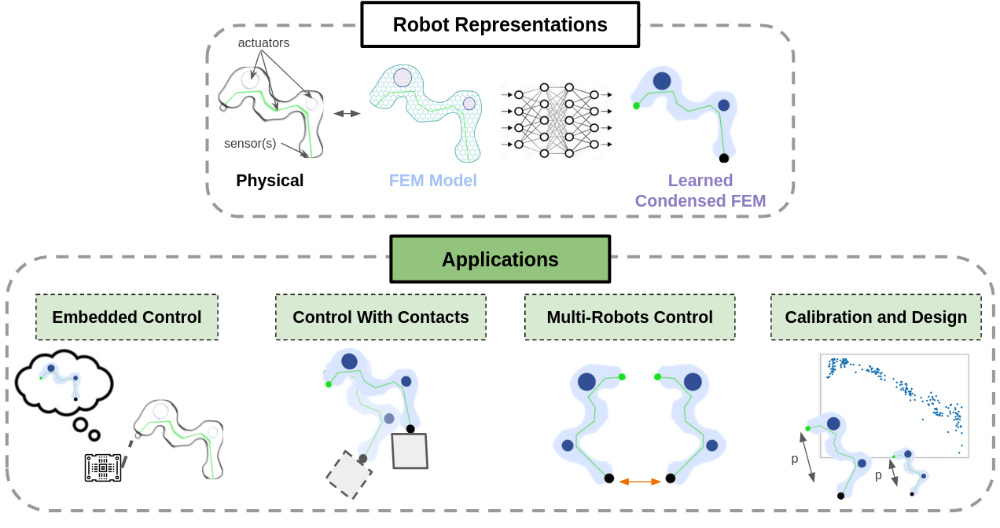
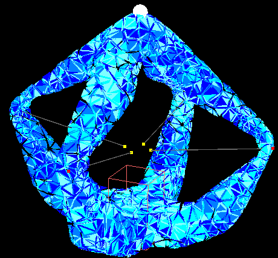
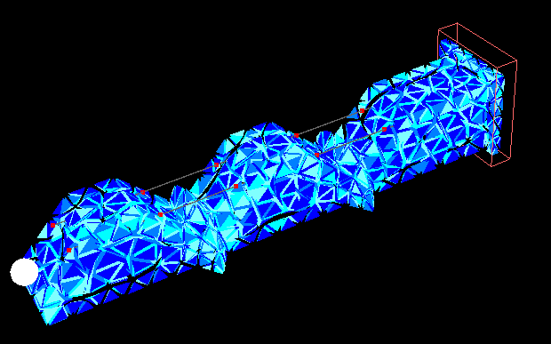
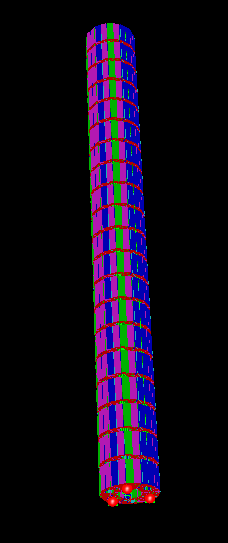

# Soft Robots Condensed FEM Model for Control and Design Optimization 
[](https://github.com/SofaDefrost/sofa) 

This plugin for the open-source simulation framework SOFA contains components for learning a condensed FEM model from a soft robot SOFA scene. We also provide an implementation for leveraging the learned model for control, embedded control, calibration and design optimization applications. 

This plugin is provided with multiple examples illustrating the aforementioned components.




# Table of Contents
- [Soft Robots Condensed FEM Model for Control and Design Optimization](#soft-robots-condensed-fem-model-for-control-and-design-optimization)
- [Table of Contents](#table-of-contents)
- [Installation ](#installation-)
  - [Python requirements](#python-requirements)
  - [SOFA and mandatory plugins](#sofa-and-mandatory-plugins)
- [Quick Start ](#quick-start-)
  - [Soft Robot Modeling](#soft-robot-modeling)
  - [User Interface](#user-interface)
    - [Baseline Direct and Inverse Simulation ](#baseline-direct-and-inverse-simulation-)
    - [Data Acquisition ](#data-acquisition-)
    - [Training a Condensed FEM model ](#training-a-condensed-fem-model-)
    - [Evaluating a Trained Condensed FEM model ](#evaluating-a-trained-condensed-fem-model-)
    - [Preparing for Embedded Control ](#preparing-for-embedded-control-)
    - [Design Optimization ](#design-optimization-)
- [Examples ](#examples-)
  - [QP-based Inverse Control of Single Soft Robots ](#qp-based-inverse-control-of-single-soft-robots-)
  - [Soft Robot Control on Specific Scenarios ](#soft-robot-control-on-specific-scenarios-)
  - [QP-based Inverse Control of Coupled Soft Robots ](#qp-based-inverse-control-of-coupled-soft-robots-)
  - [Embedded Control of Soft Robots ](#embedded-control-of-soft-robots-)
  - [Calibration of Soft Robots ](#calibration-of-soft-robots-)
  - [Design Optimization of Soft Robots ](#design-optimization-of-soft-robots-)
- [Known Issues ](#known-issues-)
- [Citing ](#citing-)


# Installation <a name="installation"></a>

## Python requirements

Python3 is needed to make use of the plugin.
The required basic python libraries can be installed with the following bash command:
```bash
pip install pathlib importlib numpy torch pickle pandas tabloo seaborn joblib
```

Additionally, some examples expect an installation of the following libraries:
* [Peewee](https://github.com/coleifer/peewee) for database management.
* [Proxsuite](https://github.com/Simple-Robotics/proxsuite) for quadratic programing solvers. 
* [Gmsh](https://gmsh.info/) for automatic mesh generation.

Both these libraries can be installed using the following bash command:
```bash
pip install proxsuite peewee gmsh==4.11.1 
```


## SOFA and mandatory plugins

This plugin was tested with the SOFA v23.06 installation. The following plugins are mandatory:
* CondensedFEMModel
* [SofaPython3](https://github.com/sofa-framework/SofaPython3)
* [SoftRobots](https://github.com/SofaDefrost/SoftRobots)

Additionally, some examples expect an installation of the following libraries:
* [STLIB](https://github.com/SofaDefrost/STLIB)

Please refer to the following [tutorial](https://www.sofa-framework.org/community/doc/getting-started/build/linux/) for a complete overview of the installation process.


# Quick Start <a name="quickstart"></a>

## Soft Robot Modeling
A scenario is described through a set of different scripts:
* A parametric SOFA simulation scene called after the model name. This scene should also reimplement a Controller class inheriting from BaseController to retrieve and impose a specific mechanical state on the soft robots.
* A Config class inheriting from BaseConfig describing the control strategy, the actuation/contacts variables, and the design variables (if relevant).


## User Interface
In this section, we introduce the main commands for using the toolbox with the Diamond example. To test these commands, first open a command prompt in the project directory, then type the commands provided below. A list of all available commands can be read in the main.py file.

### Baseline Direct and Inverse Simulation <a name="baselinesim"></a>

For running a direct simulation, the following command is available:
```bash
python3 main.py -n Diamond -app Test 
```
- -n, --name: name of the soft robot.
- -app, --application: reference to the considered applications. For baseline direct simulation, we have to specify the option "Test". The applied actuation is then the one given as initialization in the "get_actuators_variables()" function of the Config class.

Similarly, running an inverse simulation using quadratic programming is performed with:
```bash
python3 main.py -n Diamond -app TestQP 
```
- -n, --name: name of the soft robot.
- -app, --application: reference to the considered applications. For baseline inverse simulation, we have to specify the option "TestQP". The successive target goals describing the trajectory to perform are then the one given by the "get_trajectory()" function of the Config class.
- -ut, --use_trajectory: Specify to use or not the trajectory provided in the "get_trajectory()" function [Optional, default=True].

### Data Acquisition <a name="data-acquisition"></a>
Prior to learning any condensed FEM model, simulation data are acquired offline. They are directly stored in a local database. Data acquisition is performed with the following command:
```bash
python3 main.py -n Diamond -app AcquireData
```
- -n, --name: name of the soft robot.
- -app, --application: reference to the considered applications. For data acquisition, we have to specify the option "AcquireData". The considered actuation, contact, and design sampling bounds are given by the functions "get_actuators_variables()", "get_contacts_variables()" and "get_design_variables()" of the Config class.
- -ss, --sampling_strategy: selected sampling strategy for data acquisition [Optional, default="SH"].
  - Options:
    - Random, Grid, SH (Scrambled Halton), LHS (Latin Hypercube Sampling)
- -ns, --n_samples: number of samples for the train set [Optional, default=100].

Other parameters are hard coded in the main.py. It is possible to select the number of CPU to consider for parallel data acquisition as well as the ratio of validation data to sample. 


### Training a Condensed FEM model <a name="trainmodel"></a>
For training a condensed FEM model, the following command is available:
```bash
python3 main.py -n Diamond -app Training
``` 
- -n, --name: name of the soft robot.
- -app, --application: reference to the considered applications. For training a condensed FEM model predictor, we have to specify the option "Training".
- -dtMM, --design_to_MM: Use this argument for training a Neural Network to predict the initial mechanical matrices from design parameters [Optional]
- -nn, --network_name: the name of the neural network model to use [Optional, default="MLP"].
- -ml, --mode_loss: loss used for trainign the netwok [Optional, default="MSE"].
  - Options:
    - Euclidean, MSE, L1, RSE
- -nh, --n_hidden_layers: the number of hidden layers [Optional, default=3].
- -hs, --hidden_size: the size of hidden layers [Optional, default=450].
- -bs, --batch_size: the size of the batch of data used for training. Should depend on the computational power available [Optional, default=2048].
- -lr, --learning_rate: initial learning rate used for training [Optional, default=1e-3].
- -dn, --data_normalization: strategy used for normalizing input and output data of the trained neural networks [Optional, default="Std"].
  - Options:
    - None, MinMax (Min/Max normalization), Std (Standard deviation)
- -dp, --dropout_probability: the dropout probability of each hidden node. Increasing these parameters helps to better regularize the neural network [Optional, default=0].

### Evaluating a Trained Condensed FEM model <a name="assessmodel"></a>
One way to evaluate a learned condensed FEM model is to use the simulation as a ground truth. Basically, a soft robot is simulated using SOFA at each time step for retrieving the states of its effectors under a given actuation state. Finding the actuation to apply on the robot is done from the matrices output by the learned condensed FEM model and the retrieved effector states. Thus, effector states replace physical sensors. For testing a control scheme with a condensed FEM model, the following command is used:
```bash
python3 main.py -n Diamond -app TestQP -tu learned
``` 
- -n, --name: name of the soft robot.
- -app, --application: reference to the considered applications. For baseline inverse simulation, we have to specify the option "TestQP". 
- -tu, --type_use: specify how to obtain mechanical matrices [Optional, default="simulated"].
- -ut, --use_trajectory: Specify to use or not the trajectory provided in the "get_trajectory()" function [Optional, default=True].

More options for plotting loss curves and analysing data distribution are also available.

### Preparing for Embedded Control <a name="embeddedcontrol"></a>
More information on how to extract and prepare learned models for embedded control will be added in the future.

### Design Optimization <a name="designoptimization"></a>
More information on how to implement own problem and perform design optimization of soft robots will be added in the future.


# Examples <a name="examples"></a>
Below are listed various learning environments offered with the plugin. The plugin comes with components to automatically create a local database for your own applications. If you want to use our pre-recorded networks, you need our database which can be downloaded at the following [address](https://drive.google.com/file/d/1gyLWPZPL6ip6pZk5CXbv9_fxsCDhZec0/view?usp=sharing). It must be placed at the root of the [Results folder](Results). For now, only data for the Diamond and the single Soft Finger are available.

## QP-based Inverse Control of Single Soft Robots <a name="examplesinversecontrol"></a> 
Below are listed examples where a single soft robot is controlled with an inverse controller, and trajectories are considered for evaluating the learned condensed FEM model. 

|Image|Name|Description|
|----------|:-------------|:-------------|
||[Diamond](Models/Diamond/)| The Diamond robot actuated by 4 cables. A considered trajectory is a circle in a 2D plane around the tip.|
||[Soft Finger](Models/Finger/)| A Soft Finger robot actuated by 2 cables. A considered trajectory is a complete bending. Three different scenes are available with different levels of fineness of the considered mesh for FEM simulation: [coarse](Models/Finger/), [fine](Models/FingerFine/), or [super fine](Models/FingerFineFine/).|
||[Stiff Flop](Models/AbstractPneumaticTrunk/)| A soft pneumatic trunk actuated by 6 pneumatic cavities and targeted to minimally invasive chirurgy. Considered trajectory is a spiral. Three different scenes are available with different levels of fineness of the considered mesh for FEM simulations: [coarse](Models/CoarsePneumaticTrunk/), [fine](Models/MediumPneumaticTrunk/) or [super fine](Models/FinePneumaticTrunk/). |


## Soft Robot Control on Specific Scenarios <a name="examplescontrolspecificscenario)"></a> 
In progress.

## QP-based Inverse Control of Coupled Soft Robots <a name="examplesinversecontrolparallelcoupling)"></a> 
In progress.

## Embedded Control of Soft Robots <a name="examplesembeddedcontrol)"></a> 
In progress.

## Calibration of Soft Robots <a name="examplescalibration)"></a> 
In progress.

## Design Optimization of Soft Robots <a name="examplesdesignoptimization)"></a> 
In progress.


# Known Issues <a name="knownissues"></a> 


# Citing <a name="citing"></a> 
If you use the project in your work, please consider citing it with:
```bibtex
@inproceedings{menager_direct_2023,
	  title = {Direct and inverse modeling of soft robots by learning a condensed {FEM} model},
	  doi = {10.1109/ICRA48891.2023.10161537},
	  eventtitle = {2023 {IEEE} International Conference on Robotics and Automation ({ICRA})},
	  pages = {530--536},
	  booktitle = {2023 {IEEE} International Conference on Robotics and Automation ({ICRA})},
	  author = {Menager, Etienne and Navez, Tanguy and Goury, Olivier and Duriez, Christian},
	  date = {2023-05},
	  keywords = {Computational modeling, Data models, Inverse problems, Kinematics, Predictive models, Real-time systems, Soft robotics},
}
```
